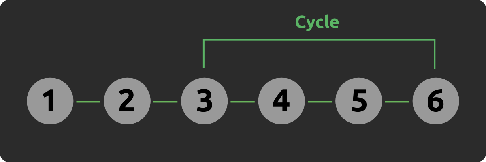

# Hare-Tortoise algorithm

The _Hare-Tortoise algorithm_, also known as _Floyd's cycle finding algorithm_, is used to detect cycles in a linked data structure. It's great because it has constant space complexity when the naive solution usually has constant.

## Implementation

- Time complexity: `O(n)`
- Space complexity: `O(1)`

```cpp
bool detectLoop() {
  Node *slow = head, *fast = head;

  while (fast != NULL && fast->next != NULL) {
    slow = slow->next;
    fast = fast->next->next;

    if (slow == fast)
      return true;
  }

  return false;
}
```

## How does it work?

It uses two pointers, the _slow pointer_ (or tortoise) travelling at normal speed and the _fast pointer_ (or hare)
travelling at double the speed. From that, it uses the fact that the hare will inevitably meet with the tortoise
in linear time unless, of course, the hare reaches the end which means there is no loop.

How in the heavens do we know it will ever meet the tortoise instead of just surpassing it forever? And how
do we know it does so in linear time?

I'm gonna try to explain it in my words, but [here](https://www.youtube.com/watch?v=gBTe7lFR3vc) is an absolutely excellent video about it if you need more visuals.

### Example

Let's say we have this linked list with a cycle:



Let's first walk through the algorithm for this example:

- The hare and the tortoise start at 1;
- Hare goes to 3, tortoise to 2;
- Hare goes to 5, tortoise to 3;
- Hare goes to 3, tortoise to 4;
- Hare goes to 5, tortoise to 5. A match that would be impossible if there were no loop!

The logic behind it is a bit mathematical and it took me a while to grasp it.

Firstly, we know that if the tortoise is to ever meet the hare, both must have entered the cycle region (in this example, 3 through 6). The tortoise is useful here because the only way a fast hare could meet the tortoise would be if it cycled back. Ok, so that's an important conclusion. Let's assume from now on that they are both on the cycle.

In the example, when tortoise is at 3, the hare is at 5 and the distance between them (forwards) is 2. In the next iteration, their distance will become 1 (tortoise at 4, hare at 3), and in the next, they'll meet. Because the hare moves twice as fast as the tortoise, the distance between them (given we know the hare must be behind the tortoise as there's a loop) will always decrease by 1 on every iteration, until they meet.

### Generalization

For the purpose of proving the hare _always_ meets the tortoise in a loop, we can focus explicitly on the cycle and generalize.

Let's suppose we reached the point where the tortoise is in the first node of the cycle. Let the distance forwards from the hare to the tortoise be $d$. On every iteration, the distance is first increased by 1 (the tortoise moves) and then decreased by 2 (the hare moves), resulting in the distance decreasing by 1 every time both move.

As the distance decreases by 1 specifically, eventually $d$ will become 0. For the hare to surpass the tortoise and loop again, $d$ would have to not go through 0, meaning the distance would need to decrease by more than 1 node at a time.

The worst case would then be if the tortoise is as far as possible from the hare, where it would take the hare $n$ moves to meet the tortoise, where $n$ is the length of the cycle. This is what makes this a linear time algorithm.

## But wait, there's more

The same algorithm can also be used to detect _where_ the cycle starts! After the hare and the tortoise meet, we reset the tortoise to the start and set the hare to move one step at a time, and then they'll meet again at the starting point of the cycle.

### Implementation

```cpp
Node* getLoopStart() {
  if (!head)
    return NULL;

  Node *slow = head, *fast = head;

  while (true) {
    if (fast == NULL || fast->next == NULL)
      return NULL;

    slow = slow->next;
    fast = fast->next->next;

    if (slow == fast)
      break;
  }

  slow = head;

  while (slow != fast) {
    slow = slow->next;
    fast = fast->next;
  }

  return slow;
}
```

### How does it work?

This will need a more methodic math view on it. [Here](https://www.youtube.com/watch?v=PvrxZaH_eZ4) is a great resource about this if you need more visuals.

Let's divide the lists into three distances.

- From the first node to the start of the loop, call it $a$
- From the start of the loop to the meeting point, call it $b$
- From the meeting point to the start of the loop, call it $c$

Note that the length of the cycle is, then, $b + c$. Call this length $l$.

To prove this approach works we need an equation stating a relationship between $a$ and $c$ that says that both parts moving one step at a time, one $a$ times from the start, and one $a$ times in the loop, will make them eventually meet at the beginning.

So let's move towards that, beginning by analyzing the distances both travelled.

The distance travelled by the hare is given by $a + c_1 * l + b$ (call it $h$), where $c_1$ is the number of times it looped, and the distance the tortoise travelled is given by $a + c_2 * l + b$ (call it $t$), where $c_2$ is the number of times it looped.

As the hare goes twice as fast as the tortoise, $h = 2t$.
Solve this expression for $a$ and we get

$a = (c_1 - 2c_2)l - b$

As $l = b + c$ and we want a relationship between $a$ and $c$, let's remove B by adding L and subtracting L

$a = (c_1 - 2c_2)l - l + l - b$

$a = (c_1 - 2c_2 - 1)l + l - b$

$a = (c_1 - 2c_2 - 1)l + c$

As $c_1$ and $c_2$ are both integers, the expression in parenthesis is also an integer, call it $c_3$. The equation now is

$a = c_3l + c$

This equations says that _the distance from the first node to the start of the loop is the same as the distance from the meeting point to the start of the cycle plus a constant amount of loops_. Therefore, when the elements meet again it will be at the start of the cycle!
