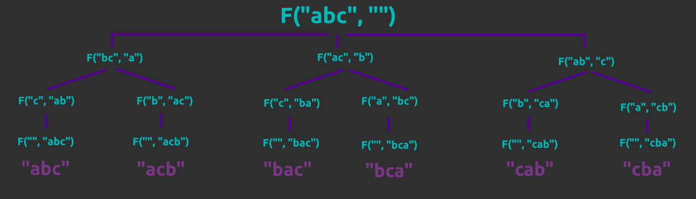
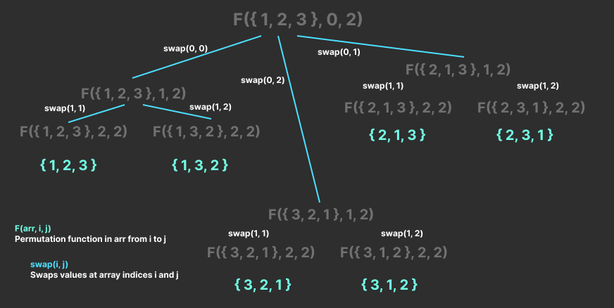

# Permutations

Say we have a set { 1, 2, 3, 4 }. How can we find all permutations of the numbers in the set?

We can use *backtracking*! It uses recursion to access every possible permutation of a set.

## Implementations

Here are two ways of implementing this.

This first one is for strings but can be adapted to any set by changing `substr` to a function that takes a slice of the set.

```cpp
void permute(string s, string answer = "", vector<string>& permutations) {
  if (s.length() == 0) {
    permutations.push_back(answer);
    return;
  }

  string remaining;

  for (int i = 0; i < s.length(); i++) {
    remaining = s.substr(0, i) + s.substr(i + 1);
    permute(remaining, answer + s[i]);
  }
}

vector<char> get_permutations(string str) {
  vector<char> permutations;
  permute(str, permutations);
  return permutations;
}
```

Here's a visualization of how it works for input `"abc"`:



The second is adapted for sets and is easily changeable for any type of `vector`. I also find this one better and clearer.

```cpp
void permute(vector<int>& nums, int start, int end, vector<vector<int>>& permutations) {
  if (start == end) {
    permutations.push_back(nums);
    return;
  }

  for (int i = start; i <= end; i++) {
    swap(nums[start], nums[i]);
    permute(nums, start + 1, end, permutations);
    swap(nums[start], nums[i]);
  }
}

vector<vector<int>> get_permutations(vector<int>& nums) {
  vector<vector<int>> permutations;
  permute(nums, 0, nums.size() - 1, permutations);
  return permutations;
}
```

Here's a visual representation of how this one works:

